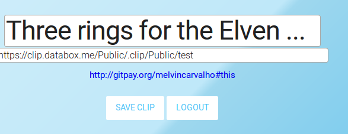
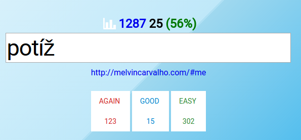

Solid Tutorials
=======

This book is a set of tutorials for the [Solid](https://github.com/solid) platform.

Each chapter will contain a tutorial showing how to build certain types of apps.

In general, it is advisable to go through each chapter in order.

The audience for this book is developers familiar with web technology that wish to learn how to use decentralized technology to create the next generation of web applications.

So, let's get started!  Please continue to [Chapter 1](https://melvincarvalho.gitbooks.io/solid-tutorials/content/chapter1.html).

Gallery
=======

## [Solid Hello World](https://melvincarvalho.gitbooks.io/solid-tutorials/content/chapter1.html)

## [Solid Clip](https://melvincarvalho.gitbooks.io/solid-tutorials/content/chapter2.html)

## [Solid Video](https://melvincarvalho.gitbooks.io/solid-tutorials/content/chapter3.html)

## [Solid Words](https://melvincarvalho.gitbooks.io/solid-tutorials/content/chapter4.html)

## [Solid Chess](https://melvincarvalho.gitbooks.io/solid-tutorials/content/chapter5.html)

## Solid Explorer

